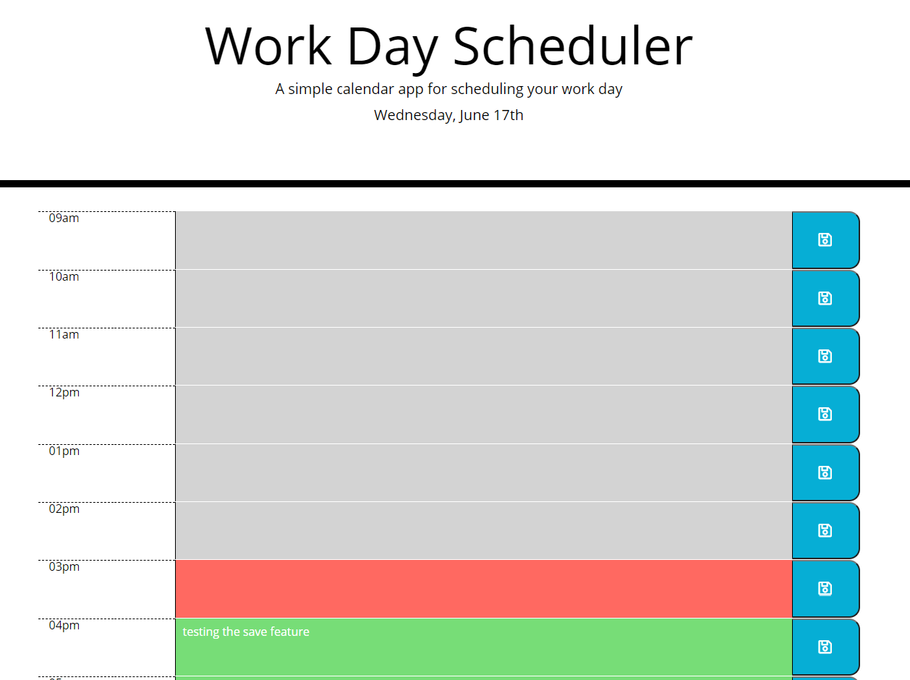

# DayPlanner
    https://jesusfernandorios.github.io/DayPlanner/

# How to use

The Dayplanner is a simple application designed for setting reminders throughout the work day. Depending on the time of day you are able to schedule your work day as you see fit. The planner will highlight the hours that have passed, the current hour and future work hours. You are able to input a reminder on hours highlighted in Green (future). The planner will save your reminder and keep it in the time slot of your choice.

# Dayplanner Screenshot

